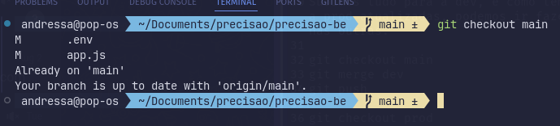
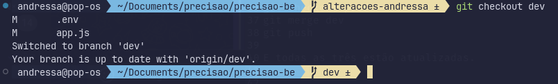
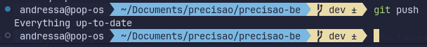

***Modo como podemos trabalhar com o git:***

1 - Cada um cria sua própria branch para fazer suas alterações

- Primeiro passo: Criar ela a partir da main. Ir para a branch main: ```git checkout main```
- 
  

- Segundo passo: Criar sua branch a partir dela: ```git checkout -b nome_da_branch```


 *(não precisa subir ela pro github, pois evita de outra pessoa entrar nela, fazer alterações e dar conflito), e faz tudo nela.*

2 - Toda vez que fizer uma nova alteração, subir um commit na própria branch dizendo o que foi feito, mas não dar push(se tentar dar push, o vscode vai pedir para subir a branch)

3 - Faz tudo na sua branch, e quando terminar, mergeia com a dev > main > prod

***Como fazer isso?***

Minha branch é: ***alteracoes-andressa***

Eu quero jogar todas as alterações que fiz nessa branch, para as outras branchs principais. 

**Como fazer?**

Primeiro passo: Sair da sua branch e ir para dev, que normalmente é a primeira:  ```git checkout dev```



Após isso, jogue o que foi feito na sua branch, para a ***dev***:  ```git merge alteracoes-andressa```


**Se der conflitos, apenas análise e resolva. Se for tudo ok, só subir as alterações com um:**

Dando o git push, vamos subir as alterações da nossa branch para a branch dev: ```git push```



4 - Subimos tudo para a dev, e como temos que deixar a main e a prod atualizadas, podemos ir fazendo esse mesmo processo nas outras.

- Para subir as alterações para a main e deixar ela atualizada:
  
```git checkout main```

```git merge dev```

```git push```

- Para subir as alterações para a prod e deixar ela atualizada:

```git checkout prod```

```git merge dev```

```git push```

***E agora todas as três estão atualizadas.***

